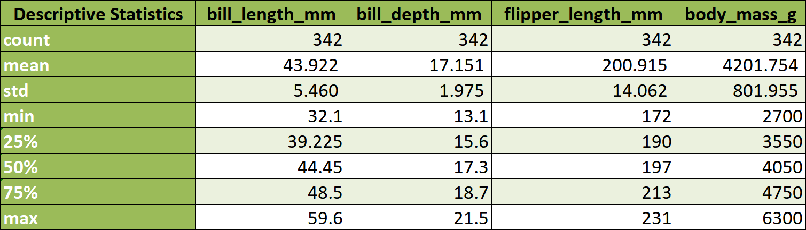

# HIgher National Diploma in Science in Computing (Data Analytics)
## Principles of Data Analytics (8634: 2024-2024)
## Author: Ebelechukwu Chidimma Igwagu
## Project Title: Analysis of the Palmer Penguins Dataset with Python
## From Github
What the project does
Why the project is useful
How users can get started with the project
Where users can get help with your project
Who maintains and contributes to the project
### Description

This repository contains my analysis of the popular [Palmer Archipelago penguins dataset](https://raw.githubusercontent.com/mwaskom/seaborn-data/master/penguins.csv).  This project provides a demonstration of essential analytical procedures utilized in exploring and visualizing raw data to provide provide valuable insights. All analysis was performed with the Anaconda (Python 3.11.5) interprter.

### BACKGROUND
The [Palmer penguins dataset](https://raw.githubusercontent.com/mwaskom/seaborn-data/master/penguins.csv) is a popular dataset that is made available by [Dr Kirsten Gorman](https://www.uaf.edu/cfos/people/faculty/detail/kristen-gorman.php) and the [Palmer Station Antarctica Long term ecological research network](https://pallter.marine.rutgers.edu/).
The  [Palmer Archipelago penguins dataset](https://raw.githubusercontent.com/mwaskom/seaborn-data/master/penguins.csv) consists of body measurements of 3 species of penguins; Adelie, Gentoo and Chinstrap found in Biscoe, Dream and Torgersen Islands in Palmer Archipelago, Antarctica. Seven variables were measured, three of which are of the object data type (Categorical) and four were of type float(numerical). The palmer penguin dataset has 344 rows and 7 columns and each of the row represents a penguin included in the study. 

### Palmer penguins dataset Variables
1. Species
2. Island
3. Bill length (mm)
4. Bill depth (mm)
5. Flipper length (mm)
6. Body mass (g)
7. Sex

## PROBLEM STATEMENT
- How are the variables in the  [Palmer penguins dataset](https://raw.githubusercontent.com/mwaskom/seaborn-data/master/penguins.csv) related?
- Can any additional information can be deduced from the [Palmer penguins dataset](https://raw.githubusercontent.com/mwaskom/seaborn-data/master/penguins.csv)?
- What limitations can be observed with the graphical representation of the data?


## USAGE

### Libraries/Prerequisites
 The analysis started off by setting up the development environment and importing the necessary libraries needed for data analysis, exploration, manipulation and visualization. The project utilized jupyter notebook in the visual studio  code environment and Anaconda python Interpreter.

```
Install Anaconda python Interpreter
Install Visual stu

```

The libraries used for this project Pandas, Numpy, matplotlib_pyplot, Seaborn and Sciplot.stats and these packages are available on the Anaconda installation package. Any additional package can be installed using pip install. Pandas was used for exploring the dataframe, Numpy - numerical arrays was utilized for data analysis while Matplotlib and seaborn was used for plotting data. These can be imported into the jupyter notebook with the command below;

```
import pandas as pd
import numpy as np
import matplotlib.pyplot as plt
import seaborn as sns
import scipy.stats as stats
```

### Loading the dataset

Once the prerequisites were installed and imported, the dataset was loaded from [here](https://raw.githubusercontent.com/mwaskom/seaborn-data/master/penguins.csv).

```
# Importing the raw data with pandas to the variable palmer_penguin

palmer_penguins = pd.read_csv("https://raw.githubusercontent.com/mwaskom/seaborn-data/master/penguins.csv")
palmer_penguins

```

## Data Exploration and understanding the data structure.
The data head and tail functions were used for a quick scan through the beginning and end of the data. The to_string() was used to present the data in a scrollable format and a summary statistics of the data is in the table below.



### Data Imputation
What is imputation (Cite)?

## Data Cleaning and  Manipulation
A copy of the original data was created before cleaning up the data as to ensure that the integrity of the original data was preserved.  Scrolling through the datsets showed that the nulltype data also known as missing values were depicted in the pandas datatframe with NAN (Not a number).
Missing values in a dataset may lead to analytical so it is essential that these are dealt with efficiently (add citation ref). These values were identified using the 'isna function'. The sex column has the highest number of missing values while rows' 3 and 339 were missing a lot of variables awhich may be due to incomplete entries. The 11 missing values under sex were substituted with the mode of the sex variable while rows 3 and 339 were dropped.

### Data Modelling
Data modelling is the process involved in extracting meaningful information from raw data by using visual representation of part or the whole dataset to communicate the connections anbetween the data points and structure (IBM). This was applied to the [Palmer penguins dataset](https://raw.githubusercontent.com/mwaskom/seaborn-data/master/penguins.csv) by first getting information the types of variables it contains.


The [Palmer penguins dataset](https://raw.githubusercontent.com/mwaskom/seaborn-data/master/penguins.csv) consists of four numerical and threee categorical variable. The variable types were put into consideration in the choice of statistical technique used. To be able to draw useful insight from data, choosing an appropriate statical tool is paramount.
To get a general overview of the variable set, the descriptive statistics was used for the numerical data and subsets of the numerical data while a histogram and a bar chart was used for the categorical variables.

## References

- https://seaborn.pydata.org/generated/seaborn.boxplot.html
- Gorman KB, Williams TD, Fraser WR (2014). Ecological sexual dimorphism and environmental variability within a community of Antarctic penguins (genus Pygoscelis). PLoS ONE 9(3):e90081. https://doi.org/10.1371/journal.pone.0090081.
- Horst AM, Hill AP, Gorman KB (2020). palmerpenguins: Palmer Archipelago (Antarctica) penguin data. R package version 0.1.0. https://allisonhorst github.io/palmerpenguins/. doi:0.5281/zenodo.3960218.


